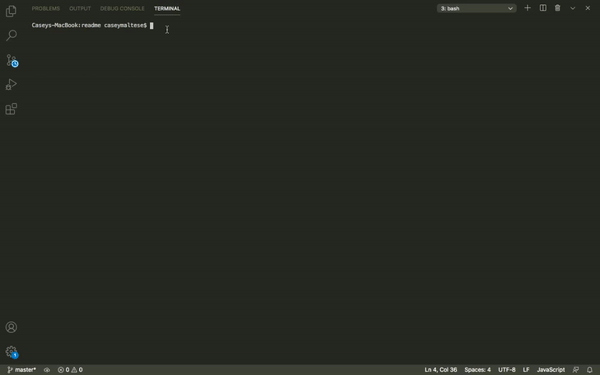

# README Generator

This is my version of a README generator.  This is a command-line app allows the user to generate a thorough README.md to minimize time creating the README in order to spend more time working on the actual project.  This app dynamically creates the file using node.js and ES6+.  JavaScript and JSON are also used.  This application is invoked with the following command: node index.js.

## GIF of README.md functionality  

## README.md generated from app:  

  # My Awesome Project
  
  ## Description
  It's an awesome project.
  ## Table of Contents
  * [Installation](#installation)
  * [Usage](#usage)
  * [License](#license)
  * [Contributing](#contributing)
  * [Tests](#tests)
  * [Questions](#questions)
  ## Installation
  To install the proper data dependencies, run the following command: npm install.
  ## Usage
  Awesome usage
  ## License
  This project is licensed under the MIT license.
  ## Contributing
  Pirata Codex
  ## Tests
  Run the following command to run tests: npm run tests.
  ## Questions
  GitHub: [caseofbase18](https://github.com/caseofbase18)  

  You can reach me at my email address, caseymaltese@gmail.com, for any additional questions.